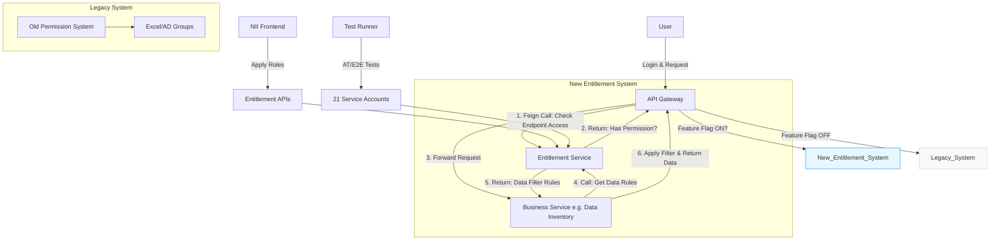
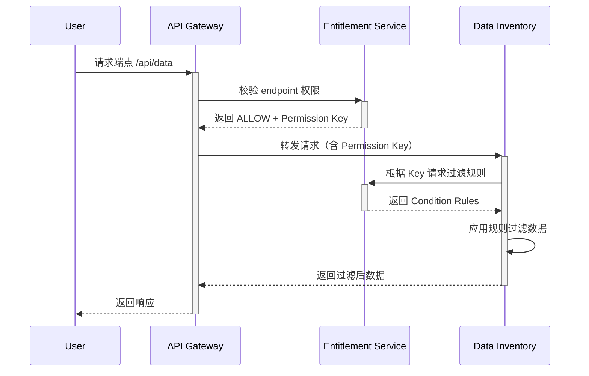
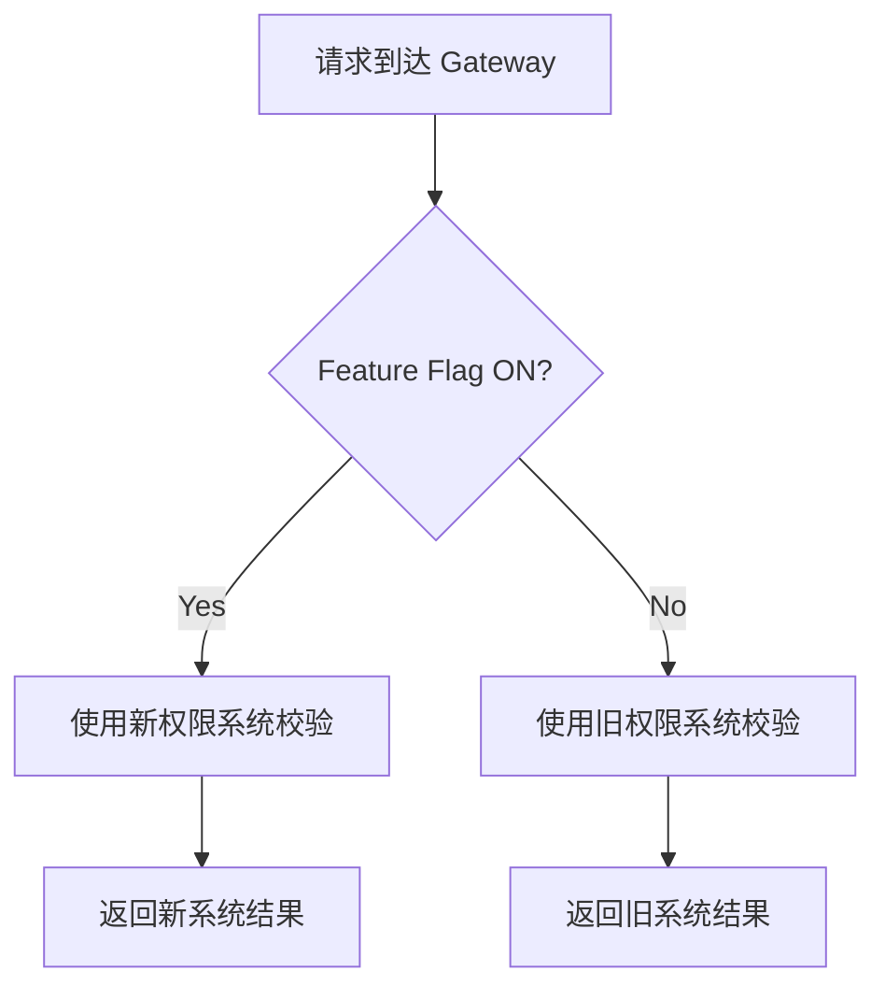
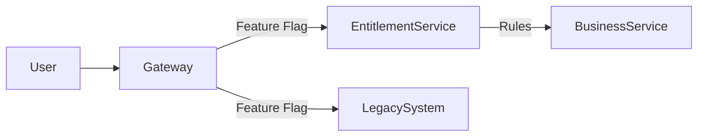

基于你的设计，我为你设计了一个清晰的**组件架构图（Component Diagram）** 和配套的**流程图说明**，帮助 UK 同事快速理解系统全貌。以下是用 Mermaid 语法绘制的可编辑图表（可直接粘贴到支持 Mermaid 的工具如 VS Code/Markdown 中生成），并附详细解释：

---

### **Entitlement Service 架构图 (Component Diagram)**


---

### **关键组件说明**
| **组件**               | **职责**                                                   |
|------------------------|----------------------------------------------------------|
| **API Gateway**        | 流量入口，根据 Feature Flag 路由到新旧权限系统；发起权限校验请求                  |
| **Entitlement Service**| 核心服务：存储权限规则（`Page/Endpoint/Condition`），提供校验接口            |
| **Business Service**   | 业务服务（如 Data Inventory），接收过滤规则并实现数据过滤逻辑                   |
| **Legacy System**      | 旧权限系统（依赖 AD Groups），通过 Feature Flag 切换                   |
| **Entitlement APIs**   | 提供的 2 个 API：uri permission checking / Data filting rules |
| **21 Service Accounts**| 模拟不同权限的测试账号，用于自动化测试                                      |
| **Feature Flag**       | 开关配置：控制是否启用新权限系统（如 `entitlement.enabled=true`）           |

---

### **核心流程详解**
#### 1. **Endpoint 访问控制流程**
```mermaid
sequenceDiagram
    User->>+API Gateway: 请求端点 /api/data
    API Gateway->>+Entitlement Service: Feign 调用：校验 endpoint 权限
    alt 有权限
        Entitlement Service-->>-API Gateway: 返回 ALLOW
        API Gateway->>+Data Inventory: 转发请求
        Data Inventory-->>-API Gateway: 返回原始数据
    else 无权限
        Entitlement Service-->>-API Gateway: 返回 DENY (403)
    end
    API Gateway-->>-User: 返回响应
```

#### 2. **数据级权限控制流程**


#### 3. **迁移兼容性设计（Feature Flag）**


---

### **图表亮点解析**
1. **双系统并行**
    - 通过 **Feature Flag** 明确标注新旧权限系统切换逻辑，解决兼容性问题
    - 旧系统灰色区块视觉隔离，新系统蓝色突出核心设计

2. **数据权限闭环**
    - 清晰展示 `Entitlement Service` 如何向业务服务（如 Data Inventory）提供动态规则
    - 强调 **Condition 规则由业务服务自主实现**（符合你定义的职责分离）

3. **关键设施显性化**
    - 测试账号（21 Service Accounts）、Entitlement APIs 直接嵌入架构图
    - 资源类型（Page/Endpoint/Condition）在 Entitlement Service 中标注

4. **UK 团队友好设计**
    - 使用标准术语（Feature Flag, Condition Rules, Service Accounts）
    - 省略中文直译词汇（如“放过” → “ALLOW/DENY”）

---

### **建议交付方式**
1. **PPT 呈现**：将架构图拆解为 3 页幻灯片逐步讲解
    - Page 1: 全局架构（展示整体组件关系）
    - Page 2: 核心流程（用序列图演示权限校验）
    - Page 3: 迁移机制（聚焦 Feature Flag 切换逻辑）

2. **重点强调**：
   ```markdown
   "Our key innovation is the **dynamic Condition Rules** passed to domain services, 
   combined with the **Feature Flag** allowing zero-downtime migration from legacy systems."
   ```

3. **备选简化图**（若需极简版）：


此设计能清晰传达你的技术方案，同时解决跨文化沟通的挑战。需要调整可随时告知！