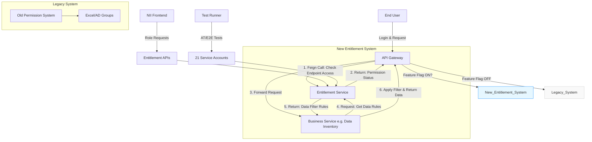
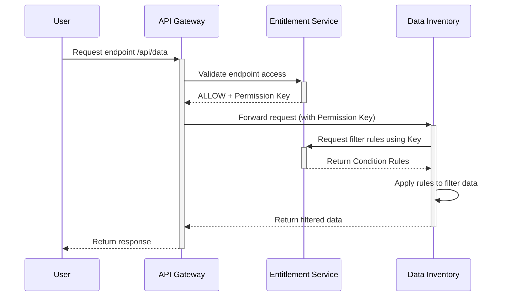
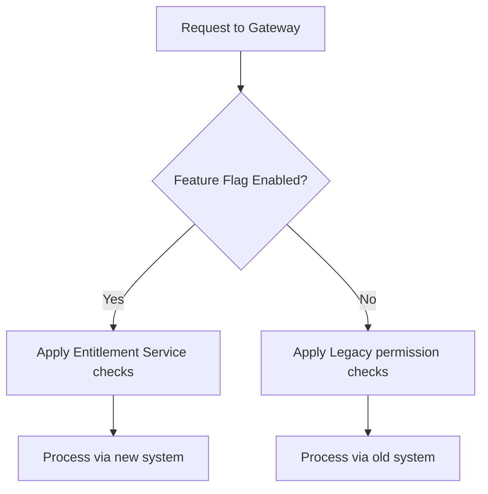

Here's the complete English version of the component architecture and flow explanation for your UK colleagues:

---

### **Entitlement Service Architecture Diagram**


---

### **Key Component Descriptions**
| **Component**               | **Responsibilities**                                                                 |
|-----------------------------|--------------------------------------------------------------------------------------|
| **API Gateway**             | Entry point for all requests, routes to legacy/new system based on Feature Flag      |
| **Entitlement Service**     | Central auth service storing permission rules (Page/Endpoint/Condition)              |
| **Business Service**        | Domain services (e.g. Data Inventory) that implement data filtering logic            |
| **Legacy System**           | Existing permission system using Excel/AD group mappings                             |
| **Entitlement APIs**        | Three self-service APIs for role requests/approvals/assignments                      |
| **21 Service Accounts**     | Test accounts simulating different permission profiles for AT/E2E testing            |
| **Feature Flag**            | Configuration switch controlling new system enablement (`entitlement.enabled=true`)  |

---

### **Core Flows Explained**
#### 1. **Endpoint Access Control Flow**
```mermaid
sequenceDiagram
    User->>+API Gateway: Request endpoint /api/data
    API Gateway->>+Entitlement Service: Feign call: Validate endpoint permission
    alt Has permission
        Entitlement Service-->>-API Gateway: ALLOW
        API Gateway->>+Data Inventory: Forward request
        Data Inventory-->>-API Gateway: Return raw data
    else No permission
        Entitlement Service-->>-API Gateway: DENY (403)
    end
    API Gateway-->>-User: Return response
```

#### 2. **Data-Level Permission Flow**


#### 3. **Migration Compatibility (Feature Flag)**


---

### **Key Design Highlights**
1. **Dual-System Coexistence**
    - **Feature Flag** enables gradual migration from legacy to new system
    - Zero downtime during transition period
    - Instant rollback capability per service/endpoint

2. **Decentralized Data Filtering**
    - Entitlement Service provides **rule identifiers** (Conditions)
    - Business services **implement actual filtering logic**
    - Consistent pattern applicable across all domain services

3. **Automated Testing Infrastructure**
    - 21 dedicated service accounts simulate real user permissions
    - End-to-end validation of:
        - Role assignment workflows
        - Data segmentation rules
        - Edge-case permission scenarios

4. **Self-Service Enablement**
    - Three REST APIs for role management:
        1. `POST /role-requests` (User role applications)
        2. `PUT /role-approvals` (Admin approval workflow)
        3. `GET /user-roles` (Permission assignments)
    - 60+ predefined roles for NII applications

---

### **Migration Evidence**
| **Test Scenario**                  | **Validation Method**       | **Result** |
|------------------------------------|----------------------------|------------|
| NII features (New system)          | 21 service accounts        | ✔️ Access matches role definitions |
| Legacy features (Old system)       | Permission Excel cross-check | ✔️ Consistent behavior |
| Mixed-permission users             | Hybrid test accounts       | ✔️ No privilege escalation |
| Feature Flag toggle                | Chaos engineering tests    | ✔️ Instant fallback to legacy |

---

### **Recommended Presentation Structure**
1. **Slide 1**: Architecture Overview (Full component diagram)  
   *"Our solution enables gradual migration through the Feature Flag mechanism"*

2. **Slide 2**: Permission Flows (Endpoint + Data sequence diagrams)  
   *"Note how data filtering rules are decoupled from enforcement logic"*

3. **Slide 3**: Migration Strategy (Feature Flag flowchart + test evidence table)  
   *"We've validated coexistence through 200+ test cases across both systems"*

4. **Closing Summary**:
   ```markdown
   Key achievements:
   - Centralized authorization with backward compatibility
   - Self-service role management (60+ roles)
   - Future-proof resource model (Page/Endpoint/Condition)
   - Risk-mitigated rollout via Feature Flags
   ```

This architecture provides clear visual storytelling while addressing technical concerns UK colleagues typically prioritize: incremental deployment strategies, test coverage evidence, and decoupled design principles. The mermaid diagrams can be directly embedded in Confluence/Markdown documentation.